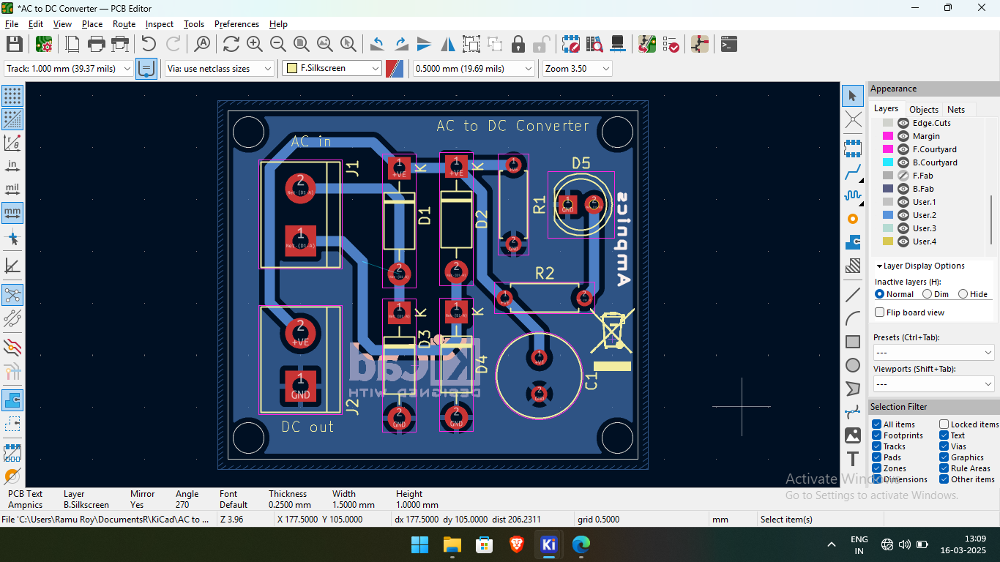
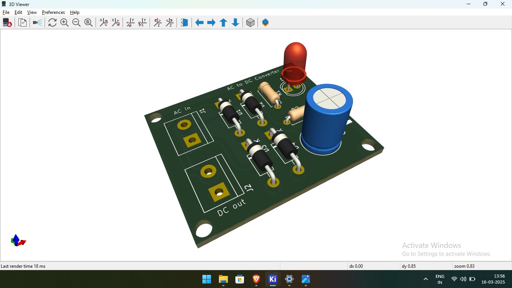

# AC-DC Converter PCB  

## 📌 Overview  
This is a **PCB design** for an **AC to DC converter**, created using **KiCad**. This circuit converts **AC voltage** to **DC voltage** using a bridge rectifier and a capacitor. The LED indicator ensures the circuit is functioning correctly.  

## 🛠️ Specifications  
- **Input Voltage**: AC (e.g., 220V to 12V AC)  
- **Output Voltage**: DC (after rectification and smoothing)  
- **Components Used**:
  - **Bridge Rectifier**: 4 × IN4007 diodes  
  - **Smoothing Capacitor**: 1000µF  
  - **Discharge Resistor**: 10kΩ  
  - **Indicator Circuit**: 2.2kΩ resistor + LED  

## 📂 Project Files  
- **Schematics** → `/Schematics/`  
- **PCB Layout** → `/PCB_Design/`  
- **Gerber Files** → `/Gerber_Files/` (for manufacturing)  
- **Images** → `/Images/` (renders & screenshots)  

## 🖼️ Preview Images  
| Schematic | PCB Layout | 3D Render |
|-----------|------------|------------|
| .png](https://github.com/ramuroy/AC-to-DC-Converter-PCB/blob/main/Images/Screenshot%20(6).png)) |  |  |

## 🔧 How to Use  
1️⃣ **Open the KiCad files** in `/Schematics/` and `/PCB_Design/`.  
2️⃣ **Modify the design** if needed and generate Gerber files for fabrication.  
3️⃣ **Use Gerber files** in `/Gerber_Files/` to order a PCB from manufacturers.  

## 🔗 Resources  
- 📺 **Ampnics Tutorial**: [Insert YouTube playlist link]  
- ⚡ **Project Discussion on LinkedIn**: [Insert LinkedIn post link]  

## 📜 License  
This project is licensed under the **MIT License** – feel free to use and modify it!
